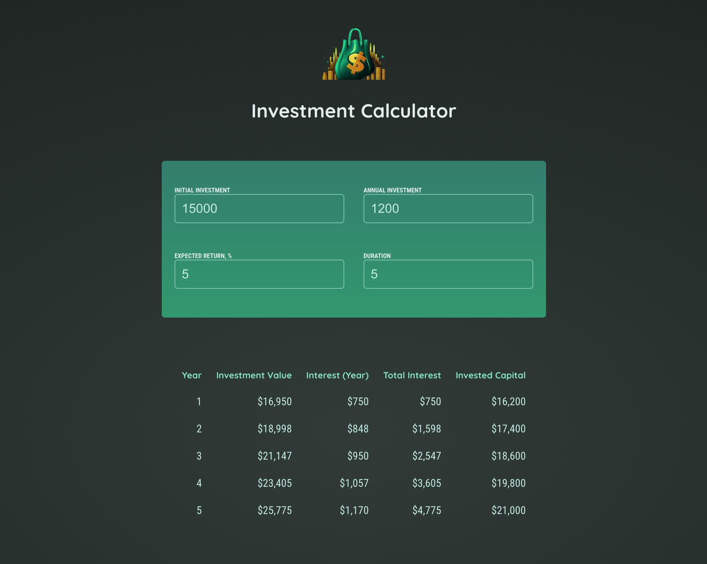

# Tic-Tac-Toe

Investment Calculator is a simple web application created with React.

You can check out a live demo of the app at https://zoromari.github.io/investment-calculator/

## Getting Started

Follow these steps to set up the project on your local machine.

Before you begin, ensure you have the following software installed:

- Node.js and npm

### Installation

1. Clone this repository to your local machine:

2. Navigate to the project directory:
cd investment-calculator

3. Install project dependencies:
npm install

### Running the App

To start the Investment Calculator app on your local development environment, run the following command:
npm run dev